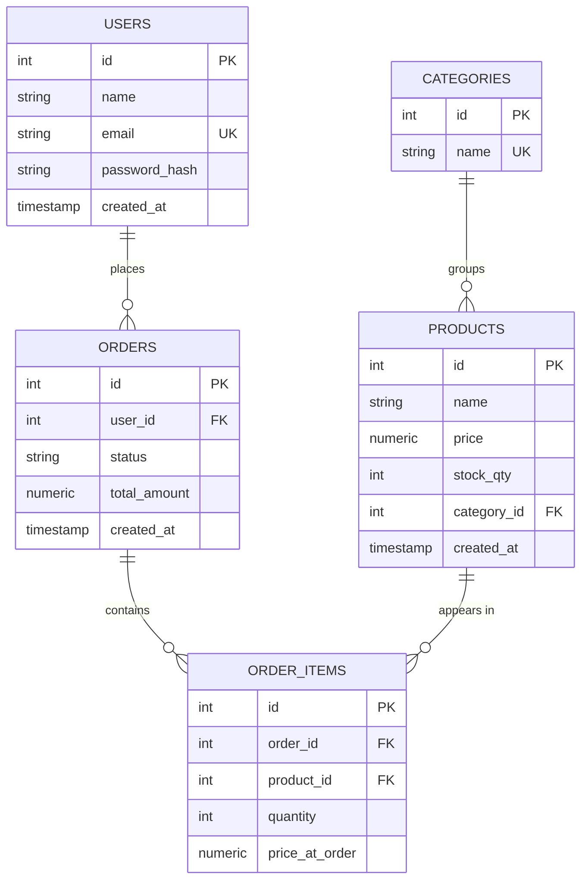
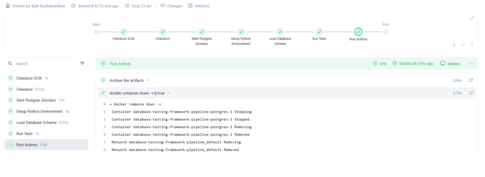
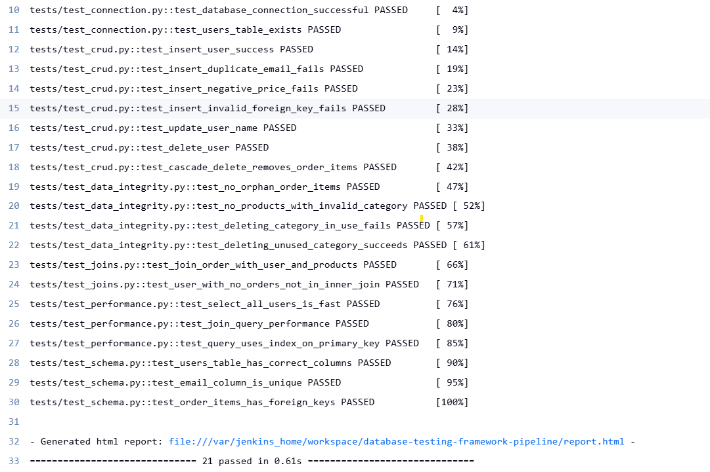

# Database Testing Framework

A Python + Pytest framework for testing a PostgreSQL e-commerce database — schema validation, CRUD operations, referential integrity, relational joins, and query performance. Containerized with Docker and automated via a Jenkins CI/CD pipeline.

Part of a Full Stack QA/SDET portfolio alongside [Playwright automation](https://github.com/YashKushalvardhan/playwright-automation-framework), [API automation](https://github.com/YashKushalvardhan/gorest-api-automation-framework), and [performance testing](https://github.com/YashKushalvardhan/petstore-jmeter-performance-testing) projects.

---

## Tech Stack

`PostgreSQL 16` · `Python` · `Pytest` · `psycopg2` · `Docker` · `Docker Compose` · `Jenkins`

---

## Schema



`order_items` resolves the many-to-many relationship between `orders` and `products`. Cascade delete is enabled on `order_items.order_id` only — categories with active products are protected from deletion by design.

---

## Test Coverage — 21 Tests

| File | Covers |
|---|---|
| `test_connection.py` | DB connectivity, table existence |
| `test_schema.py` | Column definitions, constraints |
| `test_crud.py` | Insert / Update / Delete + constraint violations |
| `test_joins.py` | Multi-table JOINs, INNER JOIN behavior |
| `test_data_integrity.py` | Orphan records, cascade/restrict rules |
| `test_performance.py` | Query execution time, `EXPLAIN` plans |

Each test runs in a transaction that's rolled back on completion — no shared state, no hardcoded IDs, no test depends on another.

---

## Project Structure

```
database-testing-framework/
├── db/                  # schema.sql, seed_data.sql, load_schema.py
├── tests/                # conftest.py + 6 test files
├── utils/                # db_connection.py
├── docker-compose.yml
├── Jenkinsfile
├── requirements.txt
└── .env.example
```

---

## Running Locally

```bash
git clone https://github.com/YashKushalvardhan/database-testing-framework.git
cd database-testing-framework

python -m venv venv
venv\Scripts\activate          # Windows
pip install -r requirements.txt

copy .env.example .env         # fill in your DB credentials

docker compose up -d
python db/load_schema.py
pytest -v --html=report.html --self-contained-html
```

---

## CI/CD

Jenkins pipeline (runs in Docker, DooD setup): checkout → spin up a fresh Postgres container → install dependencies → load schema over the network → run tests → publish HTML report → tear down container.




---

## Notable Debugging

- **Sequence values persist through rollback** — `SERIAL` doesn't reset on `ROLLBACK`, so tests were rewritten to never assume fixed IDs, only self-created or dynamically fetched data.
- **DooD networking** — Jenkins runs as a container; its `docker compose` calls target the *host's* Docker daemon, making Postgres a sibling container, not a nested one. Fixed via `host.docker.internal`.
- **Bind-mount paths break under DooD** — relative paths in `docker-compose.yml` resolve against the host filesystem, not the Jenkins container's. Schema auto-loading silently failed. Fixed by loading schema/seed data over a network connection via a small Python script instead.

---

## Author

**Yash Kushalvardhan** — SDET / QA Automation Engineer, Dublin, Ireland
[GitHub](https://github.com/YashKushalvardhan)
